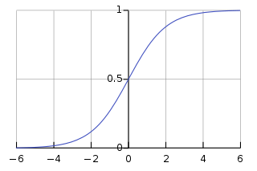

# Logistic Regression

### Introduction

> In this article we are going to discuss Logistic regression, what kind of problem does it solve, what are its limitations.

> Logistic regression is an algorithm used to solve classification problem. Classification can be done for text data, tabular (structured) data, image classification and some more. Some of the examples of classification problems can be, Emails classification (spam/non spam), online transactions (fraud or valid), Tumour (malignant or benign). Logistic regression uses labelled data for training and uses a sigmoid function to return the probabilities in the end, which can be used to determine the class of a particular test input.

### Types of Logistic regression:

* Binary classification (2 classes)
* Multi-linear functions fail Class (more than 2 classes)

### Logistic Regression

> Logistic regression is a machine learning algorithm used for classification problem. It is based on the concept of probability and one of the best and simple methods for predictive analysis.

> Logistic regression is a modified version of simple linear regression and can be easily understood if having basic knowledge of Linear regression. Logistic regression uses much complex cost function (called sigmoid function) than linear regression as it produces values between 0 and 1 while linear regression can produce anything between negative Infinity to positive Infinity which is not possible as per the hypothesis of linear regression.

$$
0≤ \widehat{y} ≤1
$$

### Sigmoid Function

> To map predicted value to probability, sigmoid function can be used. Sigmoid function maps any real value to the value between 0 to 1 including both. Sigmoid function is widely used in machine learning for predictive analysis.

> Following is the equation and graph plot for sigmoid function.

### Hypothesis

> For linear regression, we use the following equation for the hypothesis.

$$
\widehat{y} = {w} ^ {T} x+b
$$

> Where ${w} ^ {T}$ is the transpose of weight matrix and b is bias, for the simplicity, we can consider it as the equation of line $y-mx c$.

> For logistic regression we modify it as

$$
\widehat {y} = σ( {w} ^ {T} x+b )
$$

$$
σ (z) =  \cfrac {1}{1+ {e} ^ {-z}}
$$

$$
\widehat {y} =   \cfrac {1}{1+ {e} ^ {-({w} ^ {T} x+b)}}
$$

### Decision boundary

> We expect our classifier to predict a class based on the probability score when a particular testcase is passed through the trained model.

> Let's take an example of a simple binary classifier for a tumour which has two classes malignant or benign (1 for malignant, o for benign). Now we decide a threshold value which will divide the two classes.
>
> 

> In this image, the threshold is chosen as 0.5, so if the predicted value is 0.7 than it considered in class 1(malignant) and if the value is 0.3 it will fall in second class, class (benign).

### Cost function

> The objective of cost function is to be minimized, so that model we prepared will have better accuracy and minimum total error.

> In linear regression, we use the sum of squared error as our cost function but that cannot be used for logistic regression. If we try to use linear regression cost function for logistic regression, it will end up creating a non-convex function with many local optima (minima and maxima) and it will be very difficult to minimize cost function to get global minima.

> So, the loss function for logistic regression can be defined as

$$
L\left(\widehat {y}, y \right) =-\{ylog \left(\widehat {y} \right) + \left( 1-y \right) log {\left (1- \widehat {y} \right )} \}
$$

> Intuition is,

> If y=1; $L \left (\widehat {y} ,y \right ) =  - log \left (\widehat {y} \right ) $

> We want $log \left (\widehat {y} \right )$ to be large, therefore, $\left (\widehat {y} \right )$ should be large, which can't be greater than 1, because of sigmoid function.

> If y=0; $L \left (\widehat {y} ,y \right ) = -   log \left (1- \widehat {y} \right )$

> We want $log \left (1- \widehat {y} \right )$ to be large, therefore, $\left (\widehat {y} \right )$ should be small, which can't be smaller than 0, because of sigmoid function.

> So, the cost function for logistic regression will become

$$
cost( \widehat {y} ,y) =
  \begin{cases}
     -log \left (\widehat {y} \right )       & \quad \ y=1 \\
     -log \left (1- \widehat {y} \right )  & \quad \ y=0
  \end{cases}
$$

> It can be written as,

$$
J \left (w,b \right ) =  \cfrac {1}{m} \sum_{i=1}^{m} {L \left ({\widehat {y}} ^ {i} , {y} ^ {i} \right )}
$$

$$
J \left (w,b \right ) = -  \cfrac {1}{m} \sum_{i=1}^{m} \{{y log \left (\widehat {y} \right )} + \left (1-y \right ) log \left ( 1- \widehat {y}\right ) \}
$$

### Gradient descent

> Gradient descent is an algorithm which is used to minimize any function, In this case we will minimize the cost function using gradient descent.

> Gradient descent is first-order iterative optimization algorithm.

> Using gradient descent, we change weight and bias such a way that we move in the direction so the error is minimum (global minimum).
> 

$$
w=w-α \cfrac {∂}{∂w} J(w)
$$

$$
b = b -α \cfrac {∂}{∂b} J(b)
$$

> $w$ is change in weight matrix, $b$ is change in bias and $α$ is learning rate.

> An easy analogy can be, imagine a blind person on top of a mountain valley, his objective is to move to the bottom. He will do it by sensing the slope of the hill. This action is similar to calculating gradient descent and updating the parameters accordingly.

### Advantages of Logistic Regression

> It is a widely used technique because it is very efficient does not require too many computational resources, it's highly interpretable, it doesn't require input features to be scaled, it doesn't require any tuning, it's easy to regularize, and it outputs well-calibrated predicted probabilities.

> Logistic regression does work better when you remove attributes that are unrelated to the output variable as well as attributes that are very similar (correlated) to each other. Therefore Feature Engineering plays an important role in regards to the performance of Logistic and also Linear Regression.

> Because of its simplicity and the fact that it can be implemented relatively easy and quick, Logistic Regression is also a good baseline that you can use to measure the performance of other more complex Algorithms.

### Disadvantages of Logistic regression

> Logistic Regression is also not one of the most powerful algorithms out there and can be easily outperformed by more complex ones. Also, we can't solve non-linear problems with logistic regression since its decision surface is linear.

> Logistic regression will not perform well with independent variables that are not correlated to the target variable and are very similar or correlated to each other.
